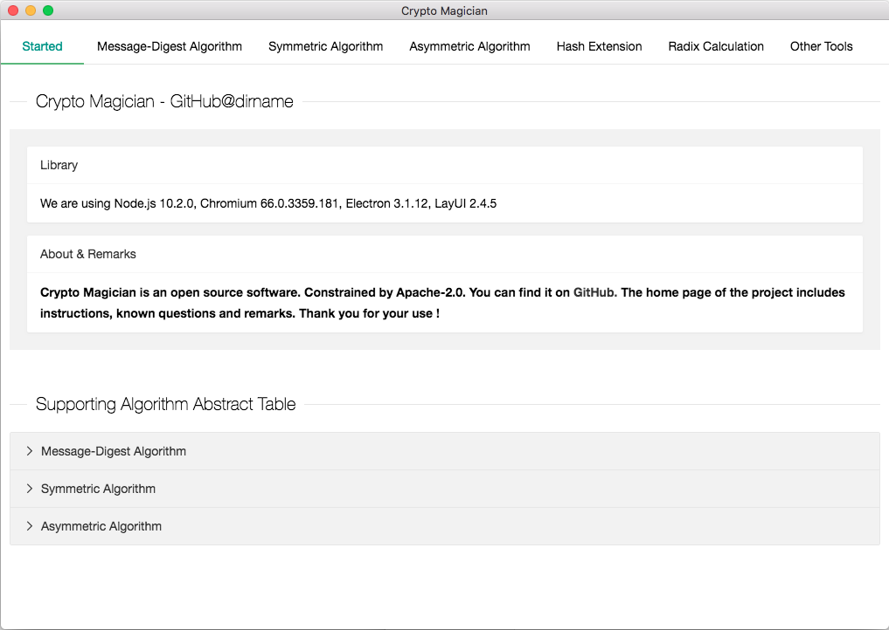
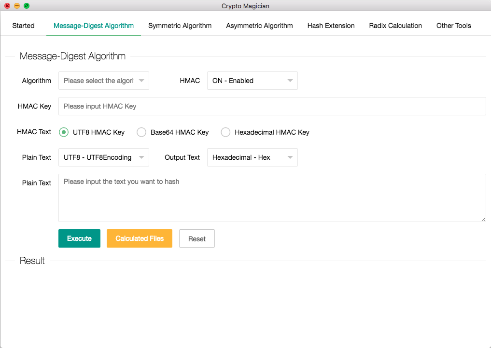
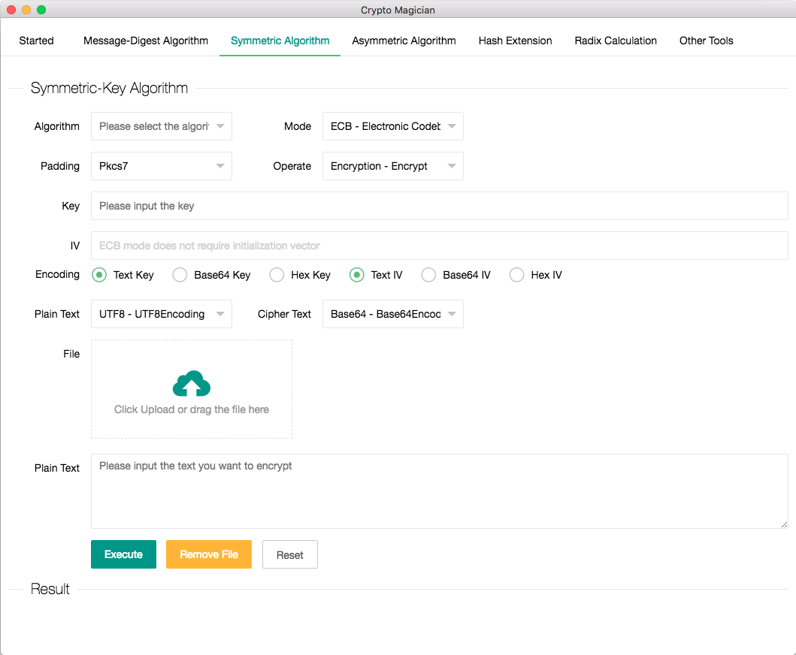
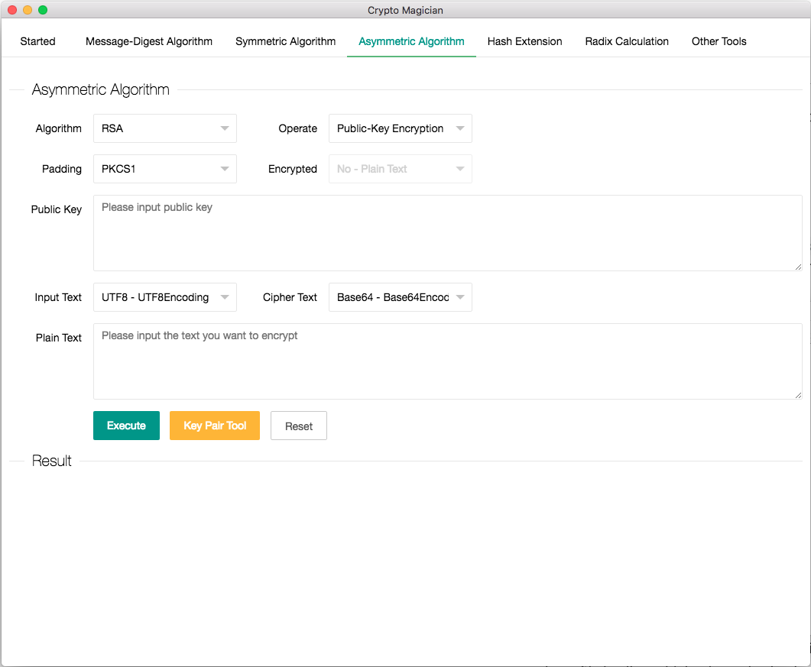
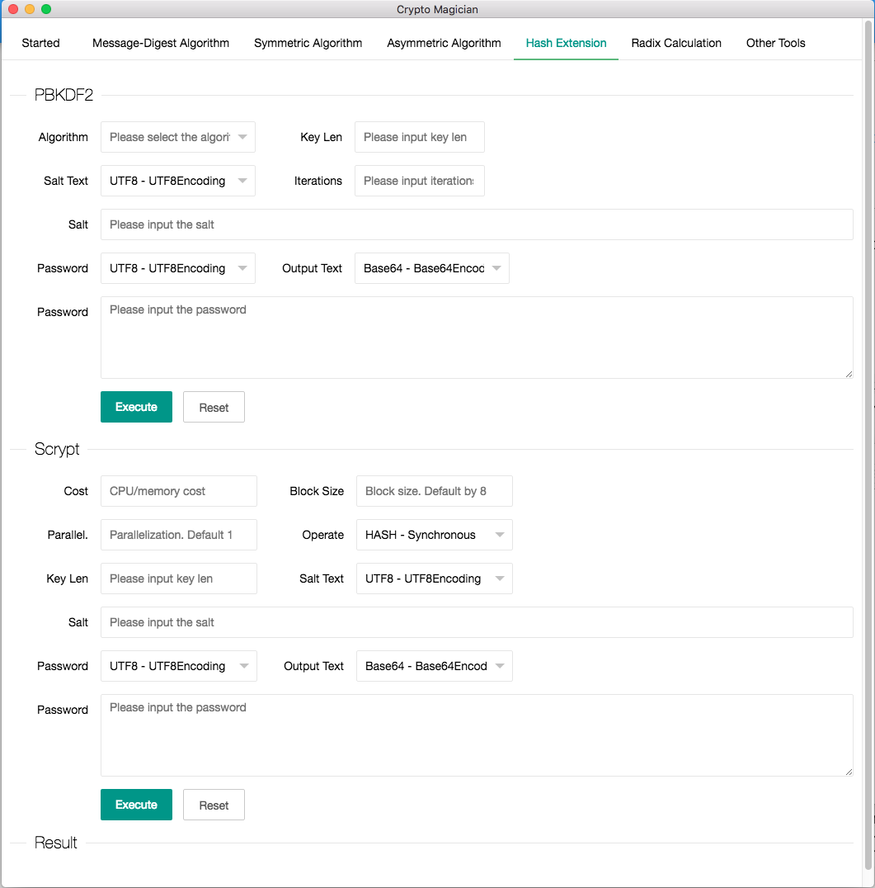
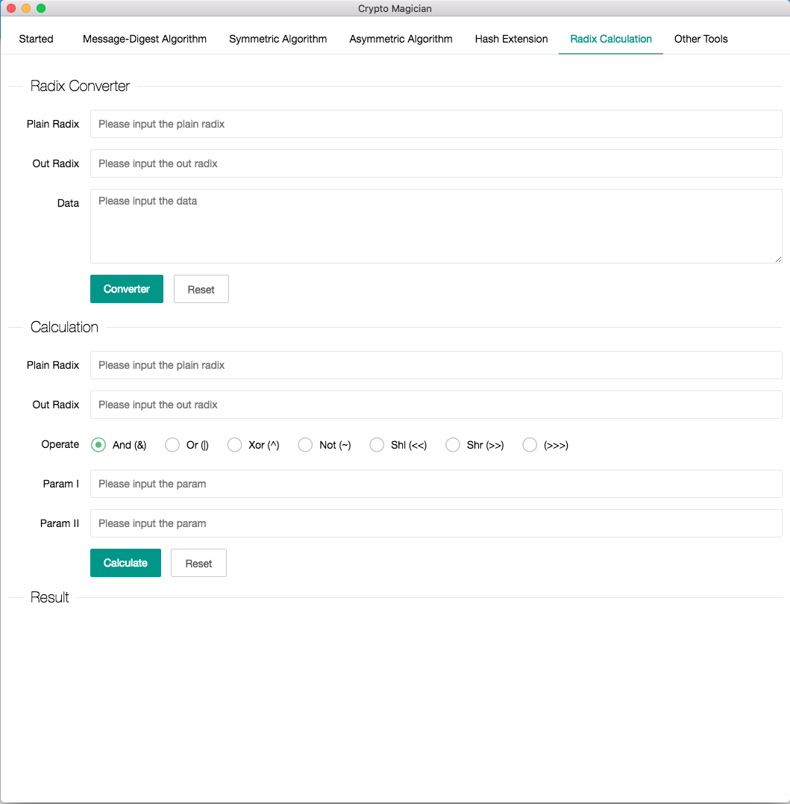
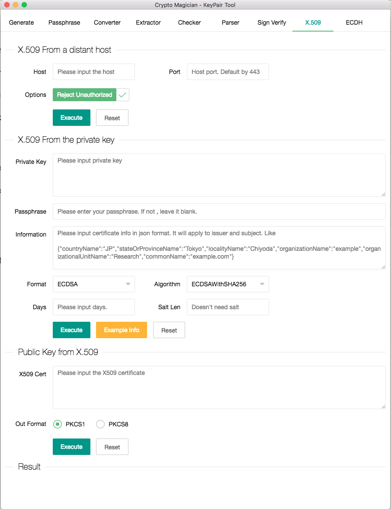
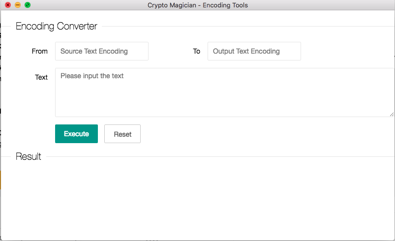
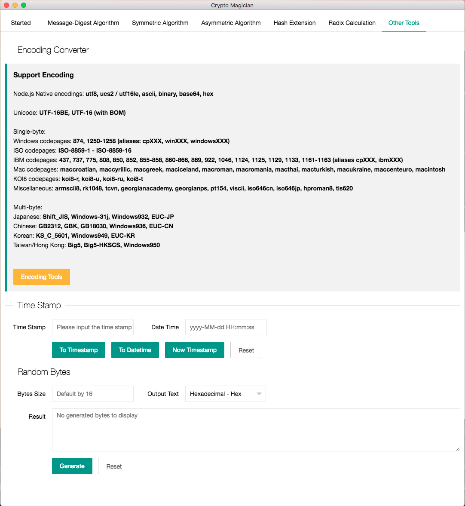

# Crypto Magician
A Powerful Encryption Tool Build On Electron

[](https://travis-ci.org/dirname/CryptoMagician)


<div align="center">
  
</div>

---
__Environment__
+ NodeJS 10.16.1 LTS
+ Electron 3.1.12
+ LayUI 2.4.5
---

# Table of Contents

* [Installation](#Installation)
* [Support Algorithm](#Support-Algorithm)
  * [Message-Digest Algorithm](#Message-Digest-Algorithm)
  * [Symmetric Algorithm](#Symmetric-Algorithm)
  * [Asymmetric Algorithm](#Asymmetric-Algorithm)
* [Building Crypto Magician](#Building-Crypto-Magician)
  * [On Unix](#On-Unix)
  * [On macOS](#On-macOS)
  * [On Windows](#On-Windows)
    * [Option 1](#Option-1)
    * [Option 2](#Option-2)
  * [Configuring Python Dependency](#Configuring-Python-Dependency)
* [Encoding Tools Supported Encoding](#Encoding-Tools-Supported-Encoding)
* [Issues](#contributing-to-nodejs)
  * [Crash of symmetric encrypted files](#Crash-of-symmetric-encrypted-files)
  * [Build failure at Electron 3.1.13 or above version](#Build-failure-at-Electron-3.1.13-or-above-version)
  * [Select box or radio button is missing](#Select-box-or-radio-button-is-missing)
* [Screenshot](#Screenshot)
  * [Started](#Started-Screenshot)
  * [Message-Digest Algorithm](#Message-Digest-Screenshot)
  * [Symmetric Algorithm](#Symmetric-Screenshot)
  * [Asymmetric Algorithm](#Asymmetric-Screenshot)
  * [Hash Extension](#Hash-Screenshot)
  * [Radix Calculation](#Radix-Screenshot)
  * [Other Tools](#Other-Screenshot)
  * [Keypair Tools](#Keypair-Screenshot)
  * [Encoding Tools](#Encoding-Screenshot)
* [Remark](#Remarks)

## Installation

``` shell script
git clone https://github.com/dirname/CryptoMagician.git
cd "Crypto Magician"
yarn install
./node_modules/.bin/electron-rebuild
yarn run start
```

## Support Algorithm


### Message-Digest Algorithm
<details>
<summary>Support Algorithm Abstract Table</summary>

Hash Name | Hex Length | HMAC Support
:-: | :-: | :-: 
RSA-MD4 | 32 Bytes | Yes
RSA-MD5 | 32 Bytes | Yes
RSA-MDC2 | 32 Bytes | Yes
RSA-RIPEMD160 | 40 Bytes | Yes 
RSA-SHA1 | 40 Bytes | Yes 
RSA-SHA1-2 | 40 Bytes | Yes 
RSA-SHA224 | 56 Bytes | Yes 
RSA-SHA256 | 64 Bytes | Yes 
RSA-SHA384 | 96 Bytes | Yes 
RSA-SHA512 | 128 Bytes | Yes 
BLAKE2B512 | 128 Bytes | Yes 
BLAKE2S256 | 64 Bytes | Yes 
MD4 | 32 Bytes | Yes 
MD4WITHRSAENCRYPTION | 32 Bytes | Yes 
MD5 | 32 Bytes | Yes 
MD5-SHA1 | 72 Bytes | Yes 
MD5WITHRSAENCRYPTION | 32 Bytes | Yes 
MDC2 | 32 Bytes | Yes 
MDC2WITHRSA | 32 Bytes | Yes 
RIPEMD | 40 Bytes | Yes 
RIPEMD160 | 40 Bytes | Yes 
RIPEMD160WITHRSA | 40 Bytes | Yes 
RMD160 | 40 Bytes | Yes 
SHA1 | 40 Bytes | Yes 
SHA1WITHRSAENCRYPTION | 40 Bytes | Yes 
SHA224 | 56 Bytes | Yes 
SHA224WITHRSAENCRYPTION | 56 Bytes | Yes 
SHA256 | 64 Bytes | Yes 
SHA256WITHRSAENCRYPTION | 64 Bytes | Yes 
SHA384 | 96 Bytes | Yes 
SHA384WITHRSAENCRYPTION | 96 Bytes | Yes 
SHA512 | 128 Bytes | Yes 
SHA512WITHRSAENCRYPTION | 128 Bytes | Yes 
SSL3-MD5 | 32 Bytes | Yes 
SSL3-SHA1 | 40 Bytes | Yes 
WHIRLPOOL | 128 Bytes | Yes 
CRC-1 | - | No 
CRC-8 | - | No 
CRC-8/1-Wire | - | No 
CRC-16 | - | No 
CRC-16/CCITT | - | No 
CRC-16/MODBUS | - | No 
CTC-16/KERMIT | - | No 
CRC-16/XMODEM | - | No 
CRC-24 | - | No 
CRC-32 | - | No 
CRC-JAM | - | No 

</details>

### Symmetric Algorithm
<details>
<summary>Support Algorithm Abstract Table</summary>

Cipher Name | Block Size | IV Size | Key Size
:-: | :-: | :-: | :-: 
3DES | 64 bits | 8 bytes | 24 bytes
AES | 128 bits | 16 bytes | 16 24 32 bytes
DES | 64 bits | 8 bytes | 8 bytes
Blowfish | 64 bits | 8 bytes | 56 bytes 
Blowfish-Compat | 64 bits | 8 bytes | 56 bytes 
IDEA | 64 bits | 8 bytes | 16 bytes 
RC2 | 64 bits | 8 bytes | 1 - 128 bytes 
SEED | 128 bits | 16 bytes | 16 bytes 
CAST | 64 bits | 8 bytes | 16 bytes 
CAST-128 (CAST5) | 64 bits | 8 bytes | 16 bytes 
CAST-256 | 128 bits | 16 bytes | 16 24 32 bytes 
CAMELLIA | 128 bits | 16 bytes | 16 24 32 bytes 
RIJNDAEL-128 | 128 bits | 16 bytes | 16 24 32 bytes 
RIJNDAEL-192 | 192 bits | 24 bytes | 16 24 32 bytes 
RIJNDAEL-256 | 256 bits | 32 bytes | 16 24 32 bytes 
GOST | 64 bits | 8 bytes | 32 bytes 
Twofish | 128 bits | 16 bytes | 16 24 32 bytes 
SERPENT | 128 bits | 16 bytes | 16 24 32 bytes 
LOKI97 | 128 bits | 16 bytes | 16 24 32 bytes 
SAFER | 64 bits | 16 bytes | 8 16 bytes 
SAFER+ | 64 bits | 16 bytes | 16 24 32 bytes 
XTEA | 64 bits | 8 bytes | 16 bytes 
3-WAY | 96 bits | 8 bytes | 12 bytes 
RC4 | 1 bits | Stream | Over 0 (5 - 256) bytes 
RC4 Drop | 1 bits | Stream | Over 0 (5 - 256) bytes 
Rabbit | 1 bits | Over 0 (8) bytes | Over 0 (16) bytes 
Rabbit Legacy | 1 bits | Over 0 (8) bytes | Over 0 (16) bytes 
CHACHA20 | 1 bits | 16 bytes | 32 bytes 
CHACHA20 POLY1305 | 1 bits | 12 bytes | 32 bytes 
WAKE | 1 bits | Stream | 32 bytes 

</details>


<details>
<summary>Support Block Cipher Mode Table</summary>

Cipher Name | ECB | CBC | OFB | CFB | CTR | CTRGladman | No Mode (Stream)
:-: | :-: | :-: | :-: | :-: | :-: | :-: | :-: 
3DES | Yes | Yes | Yes | Yes | Yes | Yes | No 
AES | Yes | Yes | Yes | Yes | Yes | Yes | No 
DES | Yes | Yes | Yes | Yes | Yes | Yes | No 
BLOWFISH | Yes | Yes | Yes | Yes | No | No | No 
BLOWFISH-COMPAT | Yes | Yes | Yes | Yes | Yes | No | No 
IDEA | Yes | Yes | Yes | Yes | No | No | No 
RC2 | Yes | Yes | Yes | Yes | No | No | No 
SEED | Yes | Yes | Yes | Yes | No | No | No 
CAST | No | Yes | No | No | No | No | No 
CAST-128 | Yes | Yes | Yes | Yes | Yes | No | No 
CAST-256 | Yes | Yes | Yes | Yes | Yes | No | No 
CAMELLIA | Yes | Yes | Yes | Yes | Yes | No | No 
RIJNDAEL-128 | Yes | Yes | Yes | Yes | Yes | No | No 
RIJNDAEL-192 | Yes | Yes | Yes | Yes | Yes | No | No 
RIJNDAEL-256 | Yes | Yes | Yes | Yes | Yes | No | No 
GOST | Yes | Yes | Yes | Yes | Yes | No | No 
TWOFISH | Yes | Yes | Yes | Yes | Yes | No | No 
SERPENT | Yes | Yes | Yes | Yes | Yes | No | No 
LOKI97 | Yes | Yes | Yes | Yes | Yes | No | No 
SAFER | Yes | Yes | Yes | Yes | Yes | No | No 
SAFER+ | Yes | Yes | Yes | Yes | Yes | No | No 
XTEA | Yes | Yes | Yes | Yes | Yes | No | No 
3-WAY | Yes | Yes | Yes | Yes | Yes | No | No 
RC4 | No | No | No | No | No | No | Yes 
RC4 Drop | No | No | No | No | No | No | Yes 
Rabbit | Yes | Yes | Yes | Yes | Yes | Yes | Yes 
Rabbit Legacy | Yes | Yes | Yes | Yes | Yes | Yes | Yes 
CHACHA20 | No | No | No | No | No | No | Yes 
CHACHA20-POLY1305 | No | No | No | No | No | No | Yes 
WAKE | No | No | No | No | No | No | Yes

</details>


### Asymmetric Algorithm

<details>
<summary>RSA Abstract Table</summary>

Cipher Name | Public-Key Encryption | Private-Key Encryption | Private-Key Decryption | Public-Key Decryption
:-: | :-: | :-: | :-: | :-: 
RSA | Yes | Yes | Yes | Yes

</details>

## Building Crypto Magician

First, Electron verison must be __3.1.12__. Versions 4.0 or above do not have full OpenSSL support, so some algorithms may not be implemented.

Before you start, make sure that you have installed the environment required for compilation

### On Unix

   * `python` (`v2.7` recommended, `v3.x.x` is __*not*__ supported)
   * `make`
   * A proper C/C++ compiler toolchain, like [GCC](https://gcc.gnu.org)

### On macOS

   * `python` (`v2.7` recommended, `v3.x.x` is __*not*__ supported) (already installed on macOS)
   * [Xcode](https://developer.apple.com/xcode/download/)
     * You also need to install the `Command Line Tools` via Xcode. You can find this under the menu `Xcode -> Preferences -> Locations` (or by running `xcode-select --install` in your Terminal)
       * This step will install `gcc` and the related toolchain containing `make`

### On Windows

#### Option 1

Install all the required tools and configurations using Microsoft's [windows-build-tools](https://github.com/felixrieseberg/windows-build-tools) using `npm install --global --production windows-build-tools` from an elevated PowerShell or CMD.exe (run as Administrator).

#### Option 2

Install tools and configuration manually:
   * Install Visual C++ Build Environment: [Visual Studio Build Tools](https://visualstudio.microsoft.com/thank-you-downloading-visual-studio/?sku=BuildTools)
   (using "Visual C++ build tools" workload) or [Visual Studio 2017 Community](https://visualstudio.microsoft.com/pl/thank-you-downloading-visual-studio/?sku=Community)
   (using the "Desktop development with C++" workload)
   * Install [Python 2.7](https://www.python.org/downloads/) (`v3.x.x` is not supported), and run `npm config set python python2.7` (or see below for further instructions on specifying the proper Python version and path.)
   * Launch cmd, `npm config set msvs_version 2017`

   If the above steps didn't work for you, please visit [Microsoft's Node.js Guidelines for Windows](https://github.com/Microsoft/nodejs-guidelines/blob/master/windows-environment.md#compiling-native-addon-modules) for additional tips.

   To target native ARM64 Node.js on Windows 10 on ARM, add the components "Visual C++ compilers and libraries for ARM64" and "Visual C++ ATL for ARM64".

### Configuring Python Dependency

If you have multiple Python versions installed, you can identify which Python
version `node-gyp` uses by setting the `--python` variable:

``` bash
$ node-gyp --python /path/to/python2.7
```

If `node-gyp` is called by way of `npm`, *and* you have multiple versions of
Python installed, then you can set `npm`'s 'python' config key to the appropriate
value:

``` bash
$ npm config set python /path/to/executable/python2.7
```


Once you're done, you can bulding the Crypto Magician. Here we will build with electron-builder. More information see [Electron Builder](https://www.electron.build/).

``` shell script
yarn install
./node_modules/.bin/electron-rebuild
yarn run pack
```

Or you want to build NSIS on Windows x64, add
```
  "scripts": {
    "dist": "electron-builder --win --x64"
  }
```
to "package.json"

For other platform, please refer to [configuration](https://www.electron.build/configuration/)


## Encoding Tools Supported Encoding

Crypto Magician's encoding tools require `iconv-lite`, so please refer to [iconv-lite wiki](https://github.com/ashtuchkin/iconv-lite/wiki/Supported-Encodings) about supported encodings 

## Issues

When you encounter problems in use, you can [open up an issue](https://github.com/dirname/CryptoMagician/issues/new). Here are some common issues.

### Crash of symmetric encrypted files

Symmetric algorithm file encryption uses the "upload" module of the LayUI. This is different from the message-digest algorithm because there is a difference in the mechanism of reading files between them. Message-digest Algorithm uses ``fs.createReadStream`` to read file and update hash on 'data' event, but after reading the file, sysmmetric algorithm encrypted the file's base64 once. According to the test, the threshold of file size at 25M is a reasonable value of relative comparison limit. But we don't guarantee that this size will work properly. So for file encryption of symmetric algorithms, we recommend that you use tools like OpenSSL to encryption.

### Build failure at Electron 3.1.13 or above version

Solution: Roll back to Electron 3.1.12

### Select box or radio button is missing

This problem may be caused by rendering. You just need to reload the page.

Solution: App Menu -> __View__ -> __Reload__

## Screenshot

### Started Screenshot



### Message-Digest Screenshot




### Symmetric Screenshot




### Asymmetric Screenshot



### Hash Screenshot



### Radix Screenshot



### Keypair Screenshot



### Encoding Screenshot



### Other Screenshot



## Remarks

+ __This software is protected by software copyright of the people's Republic of China, Certificate No. 2019SR1026044. Therefore, please abide by the open source agreement of the software.__
+ In the software version of release, we will submit your device information (__CPU, Arch, Endianness, Hostname, Platform, Release, Totalmem, UserInfo, NetworkInterfaces__) by default to obtain the running environment information of the software. If you do not want to submit your device information, you can download or [clone](https://github.com/dirname/CryptoMagician/archive/master.zip) the source code of this project to compile in [Travis](https://travis-ci.org/dirname/CryptoMagician).

